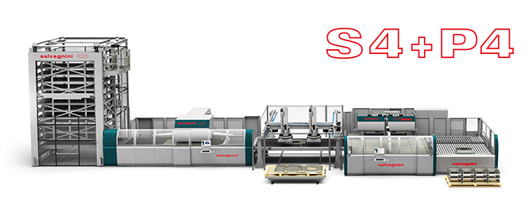

# Дипломный проект 1 года. Предсказание загрузки линии

## Оглавление

[1. Описание проекта](https://github.com/SaakyanAG/Pub/tree/main/Final%20Project/README.md#Описание%20проекта)

[2. Какой кейс решаем?](https://github.com/SaakyanAG/Pub/tree/main/Final%20Project/README.md#Какой%20кейс%20решаем?)

[3. Краткая информация о данных](https://github.com/SaakyanAG/Pub/tree/main/Final%20Project/README.md#Краткая%20информация%20о%20данных)

[4. Этапы работы над проектом](https://github.com/SaakyanAG/Pub/tree/main/Final%20Project/README.md#Этапы%20работы%20над%20проектом)

[5. Результат](https://github.com/SaakyanAG/Pub/tree/main/Final%20Project/README.md#Результат)

[6. Выводы](https://github.com/SaakyanAG/Pub/tree/main/Final%20Project/README.md#Выводы)

### Описание проекта

Трубется построить сервис для предсказания загрузки линии по производству панелей.

Необходимо:

1. Произвести сбор данных, их консолидацию и подготовку к обработке.
2. Произвести предобработку набора данных.
3. Провести разведывательный анализ данных.
4. Построить baseline и сделать выводы о возможности решения задачи
5. Построить несколько моделей машинного обучения, решающих задачу.
6. Выбрать модель и проверить повторяемость результатов.
7. Построить сервис для предсказания цен.
8. Оформить решение на GitHub

⬆️[к оглавлению](https://github.com/SaakyanAG/Pub/tree/main/Final%20Project/README.md#Оглавление)

### Какой кейс решаем?

Имеется линия по производству панелей. Мониторинг ее загрузки - крайне важная часть производственного планирования.

Возможность предсказывать ее загрузку напрямую может сказаться на контроле за исполнением сроков, администрировании персоналом и тд.

⬆️[к оглавлению](https://github.com/SaakyanAG/Pub/tree/main/Final%20Project/README.md#Оглавление)

### Этапы работы над проектом

1. Сбор данных с линии.
2. Анализ данных линии и их адаптация их к дальнейшей обработки
3. Сбор данных о заказах, их консолидация.
4. Парсинг нужных признаков по панелям из данных заказа.
5. Преобразование признаков.
6. Разведовательный анализ.
7. Решение задачи регрессии простыми методами (линейная регрессия + полиномиальные признаки).
8. Решение задачи классификации с помощью построения ансаблевых моделей и бустинга.
9. Выбор модели.
10. Результаты.
11. Построение веб-сервиса для предсказания времени.
12. Выводы.

⬆️[к оглавлению](https://github.com/SaakyanAG/Pub/tree/main/Final%20Project/README.md#Оглавление)

### Результаты:

* Произведен сбор и консолидация данных со станка.
* Произведен сбор и консолдация данных заказа.
* Подготовлен датасет для обучения.
* Произведена очистка данных и подготовка их для обучения.
* Построен ряд простых моделей, на которых произведена базовая оценка предиктивной способности.
* Построено несколько ансамблевых моделей, улучшаающих метрики качества.
* Применены различные методы оптимизации гиперпараметров моделей и улучшено их качество.
* Отработаны навыки построения процесса решения задачи в DS.
* Построен веб-сервис на базе FastApi для предсказания загруженности линии.
* Очередной раз отработаны навыки оформления кода и публикации проекта на Github.

⬆️[к оглавлению](https://github.com/SaakyanAG/Pub/tree/main/Final%20Project/README.md#Оглавление)

### Выводы:

* Построен веб-сервис для решения прикладной задачи по предсказанию загрузки линии.
* Отработаны навыки DS в реальных условиях от сбора и консолидации данных до вывода модели в продакшен.

⬆️[к оглавлению](https://github.com/SaakyanAG/Pub/tree/main/Final%20Project/README.md#Оглавление)

Если информация по этому проекту покажется вам интересной или полезной, то я буду очень вам благодарен, если отметите репозиторий и профиль ⭐️⭐️⭐️-дами
